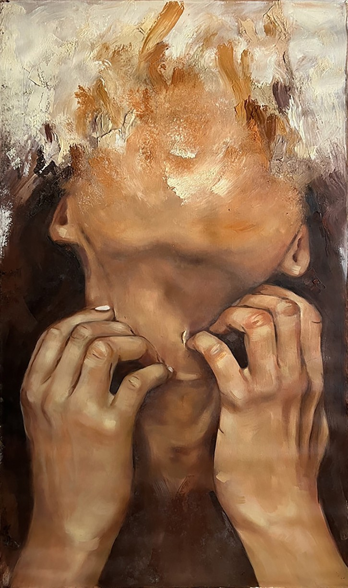

#aaga0750-idea9103-major-project
## IDEA9103 Major Project
### Part 1: Interaction Instructions
**LEFT/RIGHT ARROWS:** The left and right are used to modulate the circles' size in the background animation. Pressing the 
left arrow leads the circles to get smaller, and pressing the right arrow leads to the circles getting larger.
**UP/DOWN ARROWS:** The up and down arrows on the keypad are used to adjust the speed of the circle animation in the background.
Pressing the upward arrow results in a faster rate of movement, whereas, the downward arrow slows down the animations.
**"O" or "o":** Clicking on the letter 'o' or 'O' results in a new screamer generated each time the button is pressed. 
The new screamer figure is an image of the coded screamer, but small in size, and they move upward to the top of the canvas and dissapear off the edge. 
**"R" or "r":** When the button "R" or "r" is pressed, then there is a red flicker effect in the background at random intervals.
**"B" or "b":** When the button "B" or "b" is pressed, the background turns light blue indicative of the cold.
**"X" or "x":** As the key "X" or "x" is pressed the canvas returns to the original state without the user inputs added. 

### Part 2: Individual Approach
**Properties Animated** 
I chose user interaction as the method to drive my individual code. The reason for this is to bring a sense of approachability 
to otherwise novel, and static paintings. Adding user interaction to an iconic work of art like The Scream by Edvard Munch (1893)
aspires to engage the user and give users the freedom to reimagine this piece. 

**Unique Factor** 
The Scream (Munch, 1983) was one of the most famous of his paintings, which captured the artist's experience with a panic attack (Zaczek, 2024). The painting has since become a representation of the lived experience of mental ill-health, and even entered the contemporary world through the screaming emoticon (Zaczek, 2024). After researching more about panic attacks, and anxiety, I found several symptoms: Pounding heart, sweating, chills, depersonalisation (when one feels out-of-the-body), weakness or dizziness (NIH, 2022). Therefore, I chose to base my user input impacts on each of these symptoms. So for example, when "o" is pressed and the screamers float to the top of the screen and leave, this represents depersonalisation. Additionally, I also manipulate colour and create a flickering-like effect to simulate hot flashes. 
> In the words of Edvard Munch, "my friends walked on, and I stood there trembling with anxiety – and I sensed an infinite scream passing through nature.” (Goodreads, n.d, p. 1)

This code is unique from the other manipulations in the following ways:
- I use multiple screamers in the foreground and animate them to float upwards
- I animate the colour to flicker and be static
- I also experimented with a slider-like effect for the speed and size of the circles
- I allow for users to restore the original state of the canvas (before the artwork)

### Part 3: Creative Inspiration
1. **Painting by Madman (2023)** 
This painting was used to inspire the generation of multiple screamer figures to provide a sense of provocation.


2. **UI Animation by Oleg Frolov (n.d)** 
The slider UI in this gif was my thought process when thinking of the user arrows and how they can be made to mimic a slider.


3. **Anxiety, Painting by Jane Mykee Lopez (2021)** 
Particularly, this painting captured the loss of control and resignation which I wished to incorporate into The Scream through upward floating screamers that leave the page.


4. **Creative Coding Exercise by Alexander Traykov (n.d)** 
This colour changing dial inspired the addition of filters to represent heatwaves and chills during episodes of panic.


### Part 4: Technical Explanation
**Changes to group code** 
- Key Variables: This code introduces global variables for controlling animation parameters: circleScaleFactor, speedFactor, MAX_SCALE, MIN_SCALE, MAX_SPEED, and MIN_SPEED set limits for circle scaling and speed. The redFilter and blueFilter booleans manage red and blue filters, while flickerSpeed and flickerChance control the intensity and frequency of a red flicker effect. Arrays like skyCircles and waterCircles store data for circle objects related to different shapes (e.g., sky, water) and allow independent animation. Additionally, a screamers array dynamically holds images triggered by specific key presses.
Example code snippet:
``` js
let circleScaleFactor = 1;  // initialized the scale factor for the circles
const MAX_SCALE = 3;  // set maximum scaling factor for circles
const MIN_SCALE = 0.5; // set the minimum scaling factor for circles
```

- User Interaction with Key Presses: The arrow keys control animation: Right and Left adjust circleScaleFactor (circle size), and Up and Down modify speedFactor (animation speed), both within set limits. Pressing 'R' or 'B' activates red and blue filters for visual effects, while 'O' adds screamers to the canvas. Pressing 'X' clears all filters and screamers, resetting the canvas.

``` js
function keyPressed() { //added user interaction where pressing right arrow
    if (keyCode === RIGHT_ARROW) { 
    circleScaleFactor *= 1.1; //increases circle size by a factor of 10%
    circleScaleFactor = min(circleScaleFactor, MAX_SCALE); //upper bound
  }

  if (keyCode === LEFT_ARROW) { //added left arrow interaction
    circleScaleFactor *= 0.9; //decreases scale factor by 10% each time
    circleScaleFactor = max(circleScaleFactor, MIN_SCALE); //set lowest limit
  }
}
```

- Canvas Resets: resetCanvas() resets circleScaleFactor and speedFactor to their original values, providing a standard base for the inputs.

``` js
function resetCanvas() {
  // reset the scale and speed factors to their original values
  circleScaleFactor = originalCircleScaleFactor;
  speedFactor = originalSpeedFactor;  // reset the speed factor to normal
  console.log("Animation reset to default values."); //prevents errors
}
```

- Displays Information Box: drawInfoBox() provides an on-screen guide for user interactions, explaining key presses and controls.

- applyFilters() adds a blue filter or resets it to default, enhancing visuals based on user input. (from the p5.js library)

``` js
function applyFilters() { //adds the blue filter or resets it
  if (blueFilter) {
    background(169, 207, 231); //changes the background color to blue when the blue filter is enabled
  } else {
    background(0); // standard black background when no filter is activated
  }
}
```

- Draw(): draw() applies filters and red flickers based on conditions and draws shapes with circles on each canvas half.

**Techniques outside course** 
- loadPixels(): Loads the pixel data for the display window into an array.
https://p5js.org/reference/p5/loadPixels/
- Text formatting size and alignment for infoBox().
https://p5js.org/reference/p5/textSize/
https://p5js.org/reference/p5/textAlign/
- applyFilter() for the red and blue filters.
https://p5js.org/reference/p5/applyFilter/ 
- lerpColour to smoothen colour changes in background.
https://p5js.org/reference/p5/lerpColor/ 
- A do-while loop to continue the for loop until the statement is true. 
https://www.w3schools.com/jsref/jsref_dowhile.asp
- beginShape and endShape to draw the shaper figure.
https://p5js.org/reference/p5/beginShape/
https://p5js.org/reference/p5/endShape/

**References** 

Frolov, O. (n.d.). Fluid Slider. Dribbble. https://dribbble.com/shots/2318685-Fluid-slider

Goodreads. (n.d.). A quote by Edvard munch. Goodreads | Meet your next favorite book. https://www.goodreads.com/quotes/423364-i-was-walking-along-a-path-with-two-friends

Lopez, J. M. (2021). Anxiety painting by Jane Mykee Lopez. Saatchi Art. https://www.saatchiart.com/en-au/art/Painting-Anxiety/2071169/9694915/view?srsltid=AfmBOooezOEffGWYbHreUJUWeNUFFBSKTjZt75DKZYOCdzdN0VJMe4Gk

Madman. (2023, July 25). The real story behind the scream by Edvard munch. Master's Gaze. https://www.mastersgaze.com/en-au/blogs/notizie/the-real-story-behind-the-scream-by-edvard-munch

Munch, E. (1893). The scream, 1893 by Edvard munch. Edvard Munch - Paintings,Biography,Quotes of Edvard Munch. https://www.edvardmunch.org/the-scream.jsp

NIH. (n.d.). Panic disorder: When fear overwhelms. National Institute of Mental Health (NIMH). https://www.nimh.nih.gov/health/publications/panic-disorder-when-fear-overwhelms

Traykov, A. (n.d.). Creative coding exercise. Dribbble. https://dribbble.com/shots/11190461-Creative-Coding-Exercise

Zaczek, I. (2022, April 14). The scream. Encyclopedia Britannica. https://www.britannica.com/topic/The-Scream-by-Munch
